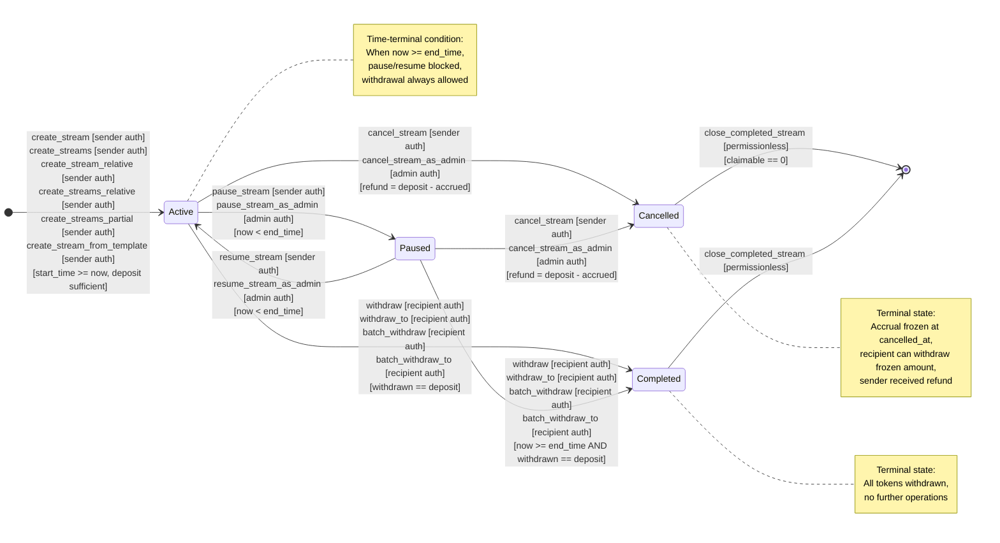

# Stream Lifecycle State Machine

This document provides a complete state-transition diagram for the Fluxora stream contract, derived exclusively from the contract source code at `contracts/stream/src/lib.rs`. It cross-references [streaming.md](./streaming.md) and [cancel-stream-semantics.md](./cancel-stream-semantics.md) for consistency.

**Source of truth:** `contracts/stream/src/lib.rs` (CONTRACT_VERSION 5, 4508 lines)

**Last verified:** 2026-05-31

## Overview

The stream contract implements a multi-state lifecycle with four primary states (`Active`, `Paused`, `Completed`, `Cancelled`) and one implicit time-based terminal condition. Every state transition is triggered by a specific entrypoint with explicit authorization and guard conditions. This diagram captures every valid transition, the entrypoint that triggers it, and the conditions that must hold.

See [streaming.md §1](./streaming.md#1-stream-lifecycle) for lifecycle phases and [cancel-stream-semantics.md](./cancel-stream-semantics.md) for cancellation refund behavior.

## State Diagram



## Transition Reference Table

| Transition | Entrypoint(s) | Auth | Guards | Notes |
|------------|---------------|------|--------|-------|
| **[*] → Active** | `create_stream`, `create_streams`, `create_stream_relative`, `create_streams_relative`, `create_streams_partial`, `create_stream_from_template` | `sender.require_auth()` | `start_time >= now`, `start_time < end_time`, `cliff_time ∈ [start_time, end_time]`, `deposit >= rate × duration`, `deposit > 0`, `rate > 0`, `sender ≠ recipient`, `!is_creation_paused()`, `rate <= max_rate_per_second` | See [streaming.md §1](./streaming.md#1-stream-lifecycle) for creation semantics. Relative-time helpers eliminate `StartTimeInPast` errors. |
| **Active → Paused** | `pause_stream`, `pause_stream_as_admin` | `sender.require_auth()` OR `admin.require_auth()` | `status == Active`, `now < end_time` | Accrual continues by time; withdrawals blocked unless `now >= end_time`. See [streaming.md §1](./streaming.md#phases) for pause behavior. |
| **Paused → Active** | `resume_stream`, `resume_stream_as_admin` | `sender.require_auth()` OR `admin.require_auth()` | `status == Paused`, `now < end_time` | Restores withdrawals. Blocked if stream is time-terminal (`now >= end_time`). |
| **Active → Cancelled** | `cancel_stream`, `cancel_stream_as_admin` | `sender.require_auth()` OR `admin.require_auth()` | `status == Active`, `!is_global_emergency_paused()` | Refund = `deposit_amount - accrued_at(cancelled_at)`. Accrual frozen at `cancelled_at`. See [cancel-stream-semantics.md](./cancel-stream-semantics.md) for complete refund semantics. |
| **Paused → Cancelled** | `cancel_stream`, `cancel_stream_as_admin` | `sender.require_auth()` OR `admin.require_auth()` | `status == Paused`, `!is_global_emergency_paused()` | Same refund rule as Active → Cancelled. Paused streams can be cancelled. |
| **Active → Completed** | `withdraw`, `withdraw_to`, `batch_withdraw`, `batch_withdraw_to` | `recipient.require_auth()` | `status == Active`, `withdrawn_amount + withdrawable == deposit_amount`, `!is_global_emergency_paused()` | Final drain triggers completion. Event order: `withdrew` then `completed`. See [streaming.md §1](./streaming.md#withdrawal). |
| **Paused → Completed** | `withdraw`, `withdraw_to`, `batch_withdraw`, `batch_withdraw_to` | `recipient.require_auth()` | `status == Paused`, `now >= end_time`, `withdrawn_amount + withdrawable == deposit_amount`, `!is_global_emergency_paused()` | Terminal liquidity: paused streams past `end_time` allow withdrawal. See [streaming.md §1](./streaming.md#4b-terminal-liquidity-paused-past-end_time). |
| **Cancelled → [*]** | `close_completed_stream` | None (permissionless) | `status == Cancelled`, `accrued_at(cancelled_at) - withdrawn_amount == 0` | Storage cleanup. Blocked if recipient has claimable balance. See [streaming.md §1](./streaming.md#cancelled-stream-closure-rule). |
| **Completed → [*]** | `close_completed_stream` | None (permissionless) | `status == Completed` | Storage cleanup. All tokens already withdrawn. |

## Invalid Transitions (Blocked by Contract)

| Attempted Transition | Blocking Error | Reason |
|---------------------|----------------|--------|
| Active → Active (double pause) | `StreamAlreadyPaused` | Redundant state change |
| Paused → Paused (double resume) | `StreamNotPaused` | Redundant state change |
| Completed → any | `InvalidState` or `StreamTerminalState` | Terminal state, no mutations allowed |
| Cancelled → any (except close) | `InvalidState` or `StreamTerminalState` | Terminal state, no mutations allowed |
| Any → any (past end_time, pause/resume) | `StreamTerminalState` | Time-terminal condition blocks pause/resume |
| [*] → Active (start_time < now) | `StartTimeInPast` | Creation guard failure |
| Active/Paused → Cancelled (globally paused) | `ContractPaused` | Global emergency pause active |

## Time-Terminal Condition

When `ledger.timestamp() >= end_time`, the stream is **time-terminal** even if `status` is `Active` or `Paused`:

- **Pause/Resume:** Blocked with `StreamTerminalState`
- **Withdrawal:** Always allowed (overrides `Paused` status)
- **Cancellation:** Still allowed (refund = 0 if fully accrued)
- **Accrual:** Capped at `end_time` (no post-end growth)

This is an implicit terminal condition enforced by `is_terminal_state()` in the contract.

## Authorization Matrix

| Operation | Sender | Recipient | Admin | Third Party |
|-----------|--------|-----------|-------|-------------|
| Create stream | ✅ Required | ❌ | ❌ | ❌ |
| Pause stream | ✅ Required | ❌ | ✅ (via `_as_admin`) | ❌ |
| Resume stream | ✅ Required | ❌ | ✅ (via `_as_admin`) | ❌ |
| Cancel stream | ✅ Required | ❌ | ✅ (via `_as_admin`) | ❌ |
| Withdraw | ❌ | ✅ Required | ❌ | ❌ |
| Close completed | ✅ Permissionless | ✅ Permissionless | ✅ Permissionless | ✅ Permissionless |

## Guard Condition Details

### Creation Guards

All creation entrypoints enforce identical validation via `validate_stream_params()`:

```rust
// Time constraints
start_time >= ledger.timestamp()  // No past starts
start_time < end_time             // Valid duration
cliff_time ∈ [start_time, end_time]  // Cliff within bounds

// Amount constraints
deposit_amount > 0
rate_per_second > 0
deposit_amount >= rate_per_second × (end_time - start_time)

// Address constraints
sender ≠ recipient  // No self-streaming

// Governance constraints
rate_per_second <= max_rate_per_second  // Admin-controlled cap

// Pause constraints
!is_creation_paused()  // Creation-only pause
!is_global_emergency_paused()  // Global emergency pause
```

### Pause/Resume Guards

```rust
// Pause (Active → Paused)
status == Active
!is_terminal_state()  // now < end_time

// Resume (Paused → Active)
status == Paused
!is_terminal_state()  // now < end_time
```

### Cancellation Guards

```rust
// Cancel (Active/Paused → Cancelled)
status == Active OR status == Paused
!is_global_emergency_paused()
```

### Withdrawal Guards

```rust
// Withdraw (Active → Completed or Paused → Completed)
status == Active OR (status == Paused AND now >= end_time)
accrued - withdrawn_amount > 0  // Something to withdraw
!is_global_emergency_paused()

// Completion trigger
withdrawn_amount + withdrawable == deposit_amount
```

### Closure Guards

```rust
// Close (Completed → [*])
status == Completed

// Close (Cancelled → [*])
status == Cancelled
accrued_at(cancelled_at) - withdrawn_amount == 0  // No claimable balance
```

## Event Emissions

Every state transition emits exactly one event:

| Transition | Event Topic | Event Payload |
|------------|-------------|---------------|
| [*] → Active | `("created", stream_id)` | `StreamCreated { stream_id, sender, recipient, deposit_amount, rate_per_second, start_time, cliff_time, end_time, withdraw_dust_threshold, memo }` |
| Active → Paused | `("paused", stream_id)` | `StreamPaused { stream_id, reason }` |
| Paused → Active | `("resumed", stream_id)` | `StreamEvent::Resumed(stream_id)` |
| Active/Paused → Cancelled | `("cancelled", stream_id)` | `StreamEvent::StreamCancelled(stream_id)` |
| Active/Paused → Completed | `("completed", stream_id)` | `StreamEvent::StreamCompleted(stream_id)` (after `withdrew` event) |
| Cancelled/Completed → [*] | `("closed", stream_id)` | `StreamEvent::StreamClosed(stream_id)` |

## Cross-References

- **[streaming.md §1](./streaming.md#1-stream-lifecycle)** - Lifecycle phases and state transitions
- **[streaming.md §2](./streaming.md#2-accrual-formula)** - Accrual calculation by status
- **[streaming.md §4](./streaming.md#4-access-control)** - Authorization matrix
- **[streaming.md §5](./streaming.md#5-events)** - Event schema
- **[cancel-stream-semantics.md](./cancel-stream-semantics.md)** - Cancellation refund and `cancelled_at` semantics

## Verification

This state machine was derived by reading the complete contract source (`contracts/stream/src/lib.rs`, 4508 lines) and cross-checking against existing documentation. No inconsistencies were found between the documented behavior and the implementation.

**States verified:** 4 primary states (Active, Paused, Completed, Cancelled) + 1 implicit time-terminal condition

**Transitions verified:** 8 valid transitions + 6 blocked transitions

**Entrypoints verified:** 6 creation entrypoints, 2 pause entrypoints, 2 resume entrypoints, 2 cancel entrypoints, 4 withdrawal entrypoints, 1 close entrypoint

**Guard conditions verified:** All auth checks, timing checks, status checks, and pause checks match implementation

**Events verified:** All event topics and payloads match emitted events in contract

## Notes for Integrators

1. **Time-terminal streams:** Check `now >= end_time` before attempting pause/resume operations. These will fail with `StreamTerminalState`.

2. **Paused withdrawal exception:** Paused streams past `end_time` allow withdrawal (terminal liquidity). Do not assume `Paused` always blocks withdrawal.

3. **Cancellation refund:** The refund amount is `deposit_amount - accrued_at(cancelled_at)`. If the stream is fully accrued at cancellation time, the sender receives zero refund.

4. **Closure precondition:** Cancelled streams can only be closed after the recipient has withdrawn the full frozen accrued amount. Attempting to close with remaining claimable balance returns `InvalidState`.

5. **Global pause:** When `is_global_emergency_paused() == true`, all mutation operations (create, withdraw, cancel, pause, resume) are blocked except admin overrides and read-only views.

6. **Relative-time helpers:** Use `create_stream_relative` or `create_streams_relative` to eliminate `StartTimeInPast` errors caused by clock drift between application and ledger.
