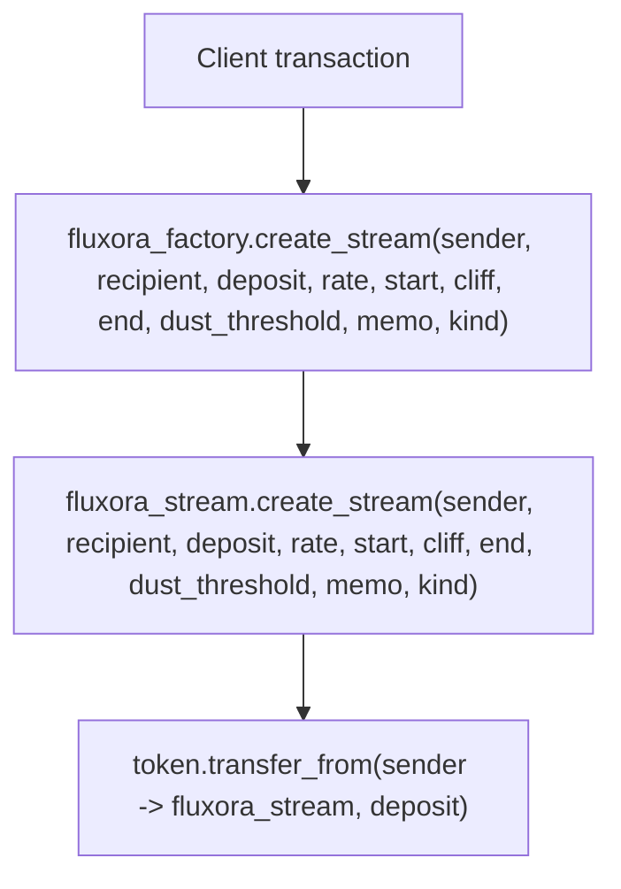
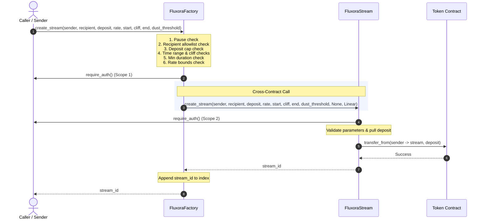

# Treasury Policy Factory Contract

The `fluxora_factory` contract is an optional wrapper around `FluxoraStream` designed specifically to enforce treasury compliance policies during stream creation.

## Overview

The base `FluxoraStream` contract is highly composable and intentionally un-opinionated about things like maximum stream sizes, minimum durations, and recipient identities. This makes it ideal as a protocol primitive. However, treasuries managing large token reserves often require strict operational policies. 

The `fluxora_factory` acts as a proxy entrypoint to enforce these policies:
- **Recipient Allowlist**: Streams can only be created for recipients explicitly allowlisted by the admin.
- **Deposit Caps**: Enforces a `MaxDepositCap` on the total `deposit_amount` of a single stream.
- **Optional Aggregate Batch Cap**: When enabled, the factory also rejects batches whose total deposit exceeds `MaxDepositCap`, preventing bypass by splitting across entries.
- **Minimum Duration**: Enforces a `MinDuration` (i.e. `end_time - start_time >= min_duration`), preventing overly short or instantaneous streams.
- **Time Relationship Checks**: Rejects invalid schedules before calling `FluxoraStream`. `start_time` must be strictly less than `end_time`, and `cliff_time` must be within the inclusive `[start_time, end_time]` window.

## Policy Parameter Validation

Policy parameters are validated before they are written by `init`, `set_cap`,
and `set_min_duration`. Invalid values are rejected at write time so the later
`create_stream` policy checks remain meaningful and cannot be silently bricked by
nonsensical stored configuration. Failed setter calls leave the previously stored
policy unchanged.

| Parameter | Entrypoints | Accepted range | Rejection error | Notes |
|-----------|-------------|----------------|-----------------|-------|
| `max_deposit: i128` | `init`, `set_cap` | `1..=i128::MAX` | `FactoryError::InvalidCap` | `0` and negative caps are rejected because every positive stream deposit would exceed them. |
| `min_duration: u64` | `init`, `set_min_duration` | `0..=3_153_600_000` seconds (`MAX_MIN_DURATION_SECONDS`, 100 365-day years) | `FactoryError::InvalidMinDuration` | `0` is valid and means no additional factory-level minimum duration beyond the required `start_time < end_time` invariant. |

These ranges are also documented in the Rust `///` comments on the factory
entrypoints. Error discriminants are append-only; `InvalidCap = 9` and
`InvalidMinDuration = 10` were added without renumbering existing values.

## Time Validation

The factory mirrors the underlying stream contract's creation-time schedule invariants and returns typed factory errors before making the cross-contract call:

| Condition | Error |
|-----------|-------|
| `start_time >= end_time` | `FactoryError::InvalidTimeRange` |
| `cliff_time < start_time` | `FactoryError::InvalidCliff` |
| `cliff_time > end_time` | `FactoryError::InvalidCliff` |

These checks keep invalid treasury requests on the factory error surface instead of relying on downstream stream-contract panics.

## Read-Only Views

The factory exposes read-only views so UIs, operators, and indexers can inspect policy before routing treasury activity through the wrapper.

| View | Returns | Notes |
|------|---------|-------|
| `get_factory_config()` | `FactoryConfig { admin, stream_contract, max_deposit, min_duration, batch_cap_enforced }` | Reads all instance policy fields. Returns `FactoryError::NotInitialized` before `init`. |
| `is_allowlisted(recipient)` | `bool` | Returns `true` only when the recipient currently has an allowlist entry. Missing entries return `false`. |

These views are permissionless and do not mutate factory state.

## Important Bypass Warning

> [!WARNING]
> Because the underlying `FluxoraStream` contract does not natively enforce these policies, **they are only enforced if the stream is created by routing through the factory contract.** 
> 
> If a user (e.g. the treasury multi-sig itself) directly calls `create_stream` on the `FluxoraStream` contract, these policies will be bypassed. To truly lock down treasury funds, the token vault or multi-sig must be configured to *only* approve transactions that invoke the `fluxora_factory` contract.

## Architecture & CEI

The factory contract follows the Checks-Effects-Interactions (CEI) pattern implicitly:
1. **Checks**: Validates the recipient against the allowlist, validates the stream time relationship, and bounds the deposit and duration against the configured caps.
2. **Effects**: No local persistent state changes occur during a successful stream creation.
3. **Interactions**: Makes a cross-contract call to `FluxoraStream::create_stream` or `FluxoraStream::create_streams`.

## Batch creation semantics

`FluxoraFactory::create_streams` is an atomic batch wrapper around `FluxoraStream::create_streams`.
- Each entry is validated against the factory policy individually.
- Each recipient in the batch must be allowlisted.
- Each stream must individually satisfy the per-stream cap and minimum duration.
- When `batch_cap_enforced` is enabled, the sum of all `deposit_amount` values in the batch is also checked against `MaxDepositCap`.
- A single invalid entry causes the entire batch to revert, ensuring no partial or policy-violating streams can be created.

## Deployment & wiring

Operating the `fluxora_factory` requires following a strict deployment sequence, initializing the contract with valid arguments, completing the policy-bootstrap checklist, and satisfying the dual-authorization model.



To deploy and wire the factory successfully:

For `fluxora_factory.create_streams`, the sender must authorize the factory batch call and the nested `fluxora_stream.create_streams` sub-invocation in the same transaction.


| Signer | Scope | Why it is required |
| --- | --- | --- |
| `sender` | `fluxora_factory.create_stream(...)` with the exact wrapper arguments | `FluxoraFactory::create_stream` calls `sender.require_auth()` after policy checks pass. |
| `sender` | Nested `fluxora_stream.create_stream(...)` with the exact stream arguments the factory forwards | `FluxoraStream::create_stream` also calls `sender.require_auth()` before validating and pulling the deposit. |

### 2. Initialization Arguments

When calling `[FluxoraFactory::init](file:///home/gamp/Desktop/Fluxora-Contracts/contracts/factory/src/lib.rs#L163-L191)`, you must provide:

| Argument | Type | Meaning | Permitted Range / Validation |
|---|---|---|---|
| `admin` | `Address` | The factory administrative owner. Authorized to update policies and change the target stream contract. | Must be a valid address. |
| `stream_contract` | `Address` | The address of the deployed and initialized `FluxoraStream` contract. | Must be a live stream contract address. |
| `max_deposit` | `i128` | The absolute maximum token deposit size allowed for any single stream created via the factory. | Must be strictly positive (`1..=i128::MAX`). Rejects non-positive caps with `FactoryError::InvalidCap`. |
| `min_duration` | `u64` | The minimum duration (in seconds) required for any stream created via the factory. | Must be within `0..=MAX_MIN_DURATION_SECONDS` (100 years). Rejects values outside range with `FactoryError::InvalidMinDuration`. |

### 3. Policy Bootstrap Checklist

Before any client or caller attempts to invoke `create_stream` via the factory, the admin must complete the following configuration steps:

- [ ] **Allowlist Recipients**: By default, the allowlist is empty. The admin **must** call `[set_allowlist](file:///home/gamp/Desktop/Fluxora-Contracts/contracts/factory/src/lib.rs#L212-L223)` to set `allowed = true` for each recipient address. Any attempt to create a stream for a recipient that is not explicitly allowlisted will fail with `FactoryError::RecipientNotAllowlisted`.
- [ ] **Verify Deposit Cap**: Verify that the initial `max_deposit` limit set during initialization fits operational needs. If it needs adjustments, the admin must call `[set_cap](file:///home/gamp/Desktop/Fluxora-Contracts/contracts/factory/src/lib.rs#L229-L237)`.
- [ ] **Verify Min Duration**: Verify that `min_duration` is appropriate. If it needs adjustments, the admin must call `[set_min_duration](file:///home/gamp/Desktop/Fluxora-Contracts/contracts/factory/src/lib.rs#L245-L253)`.
- [ ] **Optional Rate Bounds**: If inclusive upper/lower bounds on the rate-per-second are desired, call `[set_rate_bounds](file:///home/gamp/Desktop/Fluxora-Contracts/contracts/factory/src/lib.rs#L262-L293)` to set them.

### 4. Dual-Authorization Requirement

Creating a factory-routed stream is a single atomic transaction, but the funding `sender` must provide authorization signatures for **two nested scopes**:

1. **Outer Scope**: Auth for the `[FluxoraFactory::create_stream](file:///home/gamp/Desktop/Fluxora-Contracts/contracts/factory/src/lib.rs#L424-L540)` wrapper call.
   - Enforced by `[sender.require_auth()](file:///home/gamp/Desktop/Fluxora-Contracts/contracts/factory/src/lib.rs#L503)` in the factory contract.
2. **Inner Scope**: Auth for the nested cross-contract `[FluxoraStream::create_stream](file:///home/gamp/Desktop/Fluxora-Contracts/contracts/stream/src/lib.rs#L2138-L2150)` call.
   - Enforced by `[sender.require_auth()](file:///home/gamp/Desktop/Fluxora-Contracts/contracts/stream/src/lib.rs#L2151)` in the stream contract.

*(Note: In previous/historical versions of the factory codebase, this authorization logic was tracked under [contracts/factory/src/lib.rs:224-250](file:///home/gamp/Desktop/Fluxora-Contracts/contracts/factory/src/lib.rs#L224-L250). In the current source, it is executed within the `[create_stream](file:///home/gamp/Desktop/Fluxora-Contracts/contracts/factory/src/lib.rs#L424-L540)` function).*

The client must assemble a Soroban transaction with an authorization tree where the `sender` signs both the root factory call and the sub-invocation matching the exact forwarded arguments. If either authorization scope is missing or does not match the invocation parameters, the transaction will fail.

#### Worked client-signing example

Assume a treasury UI wants to create this routed stream:
```text
sender = G_SENDER
recipient = G_RECIPIENT
deposit_amount = 1_000
rate_per_second = 1
start_time = 1_800_000_000
cliff_time = 1_800_000_000
end_time = 1_800_001_000
withdraw_dust_threshold = 0
```

The client prepares a transaction whose root host function invokes `fluxora_factory.create_stream` with those values. During simulation/preparation, the authorization tree must contain `G_SENDER` for the root factory call and the nested `fluxora_stream.create_stream` sub-invocation with:
```text
memo = None
kind = Linear
```
`G_SENDER` signs that prepared authorization tree. The factory admin does not sign stream creation unless the admin is also the `sender`. The recipient does not sign creation.

#### Single-auth vs dual-scope auth

For UI and wallet copy, describe the flow as "one sender signing session with two scopes" rather than "two unrelated signatures":
1. The factory scope lets the sender opt into the treasury policy wrapper.
2. The stream scope lets the stream contract create the stream and pull exactly the authorized deposit from the sender.

If the client omits either scope, the transaction fails at the corresponding `require_auth` call. If the sub-invocation arguments differ from the signed arguments, the nested authorization is not valid for that call.

### 5. Call & Authorization Topology Diagram

The following diagram illustrates the call topology and authorization path during stream creation:



### 6. Exhaustive Error Code & Policy Mapping

Below is the complete set of `[FactoryError](file:///home/gamp/Desktop/Fluxora-Contracts/contracts/factory/src/lib.rs#L30-L57)` codes that can be returned during a call to `[FluxoraFactory::create_stream](file:///home/gamp/Desktop/Fluxora-Contracts/contracts/factory/src/lib.rs#L424-L540)`, along with the underlying policy or guard they represent:

| Error Variant | Value | Associated Policy / Guard | Trigger Condition |
|---|---|---|---|
| `NotInitialized` | 2 | Initialization check | The factory contract has not been initialized. |
| `RecipientNotAllowlisted` | 4 | Recipient Allowlist policy | The `recipient` address is not present in the allowlist or is marked `false`. |
| `DepositExceedsCap` | 5 | Deposit Cap policy | The requested `deposit_amount` exceeds the configured `MaxDepositCap`. |
| `DurationTooShort` | 6 | Minimum Duration policy | The stream duration (`end_time - start_time`) is less than the configured `MinDuration`. |
| `InvalidTimeRange` | 7 | Time validation policy | The requested `start_time` is greater than or equal to the `end_time`. |
| `InvalidCliff` | 8 | Time validation policy | The `cliff_time` is outside the inclusive `[start_time, end_time]` window. |
| `CreationPaused` | 9 | Factory pause guard | The factory stream creation has been paused by the admin. |
| `StreamContractPaused` | 10 | Downstream contract state | The underlying `FluxoraStream` contract is paused. |
| `StreamContractError` | 11 | Downstream contract validation | The downstream contract rejected the stream creation for reasons other than pause state (e.g., duplicate IDs, insufficient token balance/allowance). |
| `RateBelowMin` | 12 | Rate bounds policy | The `rate_per_second` is below the configured `MinRatePerSecond`. |
| `RateAboveMax` | 13 | Rate bounds policy | The `rate_per_second` is above the configured `MaxRatePerSecond`. |

### 7. Limitations & Hardcoded Invariants

> [!IMPORTANT]
> The `fluxora_factory` routes stream creation using a hardcoded set of streaming style parameters (see [contracts/factory/src/lib.rs:523-524](file:///home/gamp/Desktop/Fluxora-Contracts/contracts/factory/src/lib.rs#L523-L524)):
> - `kind` is hardcoded to `StreamKind::Linear`.
> - `memo` is hardcoded to `None`.
>
> If you need to create streams with a different streaming style (such as `StreamKind::CliffOnly`) or include a custom `memo`, you **must** call the `FluxoraStream` contract directly. These cannot be routed through the factory.

### 8. Admin Controls

The factory has an `Admin` key managed via `set_admin`. The admin can:
- Call `set_allowlist` to grant or revoke recipient eligibility.
- Call `set_cap` to update the max deposit limit.
- Call `set_min_duration` to update the minimum duration requirement.
- Call `set_batch_cap_enforcement` to toggle aggregate batch-cap validation.
- Call `set_stream_contract` to upgrade or switch the underlying stream primitive if a new version is deployed.
- Call `set_rate_bounds` to configure optional inclusive rate-per-second bounds.

- For general contract storage layout rules, key persistence types, and structural evolution rules, see [docs/storage.md](file:///home/gamp/Desktop/Fluxora-Contracts/docs/storage.md).
- For details on underlying stream calculations, stream lifecycles, and events, see [docs/streaming.md](file:///home/gamp/Desktop/Fluxora-Contracts/docs/streaming.md).

## Events

Every state-changing factory entrypoint emits a structured Soroban event so that
indexers, treasury dashboards, and monitoring tools can observe policy changes and
stream creation without re-reading storage. Topic symbols are ≤ 9 characters per
the `symbol_short!` constraint.

| Entrypoint | Topic | Data struct | Notes |
|---|---|---|---|
| `init` | `fct_init` | `FactoryInited { admin, stream_contract, max_deposit, min_duration }` | Emitted once on deployment. |
| `set_admin` | `AdminUpd` | `FactoryAdminUpdated { old_admin, new_admin }` | Mirrors the `AdminUpd` topic used in `FluxoraStream`. |
| `set_stream_contract` | `stm_upd` | `StreamContractUpdated { old_contract, new_contract }` | Emitted after the pointer is updated. |
| `set_allowlist` | `allow_upd` | `AllowlistUpdated { recipient, allowed }` | `allowed: true` = added; `false` = removed. Sufficient for an indexer to reconstruct membership. |
| `set_cap` | `cap_upd` | `CapUpdated { old_cap, new_cap }` | Both old and new values are included. |
| `set_min_duration` | `dur_upd` | `MinDurationUpdated { old_min_duration, new_min_duration }` | Both old and new values are included. |
| `set_rate_bounds` | `rate_bnd` | `RateBoundsUpdated { min_rate, max_rate }` | Carries the arguments passed by the caller; `None` means "unchanged". |
| `set_factory_paused` | `factory` + `paused`/`resumed` | `bool` | Pre-existing event, unchanged. |
| `create_stream` (success) | `fct_strm` | `FactoryStreamCreated { stream_id, sender, recipient, deposit_amount, rate_per_second }` | Emitted only after the cross-contract call succeeds. Lets indexers attribute a stream to the policy-gated factory path. |

See [docs/events.md](events.md) for the complete event catalogue across all contracts.

## Code alignment checklist

This document is aligned with the current implementation as follows:

- `FluxoraFactory::init`, `set_cap`, and `set_min_duration` validate policy
  ranges before writing factory configuration.
- `FluxoraFactory::create_stream` enforces allowlist, cap, and duration checks
  before calling `sender.require_auth()`.
- The factory forwards a linear `FluxoraStream::create_stream` call with
  `memo = None` and `StreamKind::Linear`.
- `FluxoraStream::create_stream` calls `sender.require_auth()` before validating
  parameters and pulling `deposit_amount` from `sender`.
- `contracts/stream/tests/factory_policy.rs` covers policy input validation,
  factory policy gates, append-only error discriminants, and admin-guarded
  policy updates that surround this authorization model.
- Every state-changing entrypoint emits a structured event; see the Events table above.
