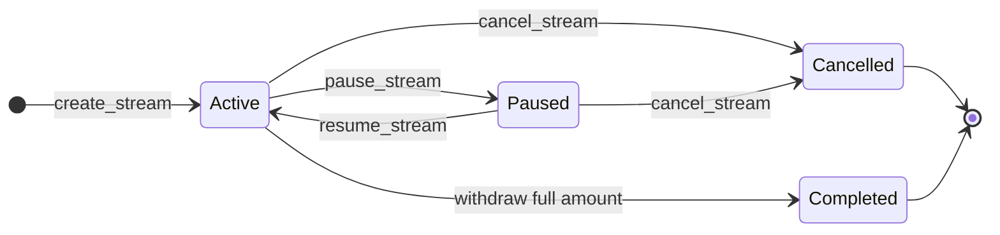

# Fluxora Stream Contract Documentation

Onboarding and integration reference for developers and auditors. Describes stream lifecycle, accrual formula, cliff/end_time behavior, access control, events, and error codes.

**Source of truth:** `contracts/stream/src/lib.rs`, `contracts/stream/src/accrual.rs`

## Sync Checklist

When changing the contract:

- Update this doc if you change lifecycle, access control, events, or panic messages
- Run `cargo test -p fluxora_stream` before committing
- No behavior change required for doc-only updates

---

## 1. Stream Lifecycle

### Phases

| Phase | Action | Notes |
|-------|--------|-------|
| **Creation** | `create_stream` | Sender deposits tokens; stream starts as `Active` |
| **Pause** | `pause_stream` / `pause_stream_as_admin` | Stops withdrawals; accrual continues by time |
| **Resume** | `resume_stream` / `resume_stream_as_admin` | Restores withdrawals |
| **Cancellation** | `cancel_stream` / `cancel_stream_as_admin` | Refunds unstreamed amount to sender; accrued amount stays for recipient |
| **Withdrawal** | `withdraw` | Recipient pulls accrued tokens |
| **Delegated Action** | `delegated_release` / `delegated_refund` | Holder uses an unexpired capability with scoped rights |
| **Completion** | Automatic | When `withdrawn_amount == deposit_amount`, status becomes `Completed` |

### State Transitions

- **Active** ↔ **Paused** (via pause/resume)
- **Active** or **Paused** → **Cancelled** (terminal)
- **Active** → **Completed** (when recipient withdraws full deposit; terminal)

Terminal states: `Completed`, `Cancelled`. They cannot transition to any other state.



---

## 2. Accrual Formula

**Location:** `contracts/stream/src/accrual.rs`

```text
if current_time < cliff_time           → return 0
if start_time >= end_time or rate < 0  → return 0

elapsed_now = min(current_time, end_time)
elapsed_seconds = elapsed_now - start_time   // 0 if underflow
accrued = elapsed_seconds * rate_per_second  // on overflow → deposit_amount
return min(accrued, deposit_amount).max(0)
```

### Rules

- **Before cliff:** Returns 0 (no withdrawals allowed)
- **After cliff:** Accrual computed from `start_time`, not from cliff
- **No cliff:** Set `cliff_time = start_time` for immediate vesting
- **After end_time:** Elapsed time is capped at `end_time` (no post-end accrual)
- **Overflow:** Multiplication overflow yields `deposit_amount` (safe upper bound)
- **Completed:** `calculate_accrued` returns `deposit_amount` (deterministic final value)
- **Cancelled:** `calculate_accrued` is frozen at `cancelled_at` (no post-cancel growth)

### Withdrawable Amount

```text
withdrawable = accrued - withdrawn_amount
```

---

## 3. Cliff and end_time Behavior

### Cliff

- Must be in `[start_time, end_time]` (enforced at creation)
- Before `cliff_time`: accrued = 0, no withdrawals
- At or after `cliff_time`: accrual uses elapsed time from `start_time`, not cliff

### end_time

- Must satisfy `start_time < end_time`
- Accrual uses `min(current_time, end_time)` as the upper bound
- After `end_time`, accrued stays at `min((end_time - start_time) * rate_per_second, deposit_amount)`
- No extra accrual beyond `end_time`

### Deposit Validation

At creation:

```text
deposit_amount >= rate_per_second * (end_time - start_time)
```

---

## 4. Capability Delegation

Capabilities provide precise, short-lived delegation without granting admin or role-level rights.

### Capability model

- `Capability` fields: `owner`, `holder`, `action`, `amount_limit`, `remaining_amount`, `expiry`, `revoked`, `stream_id`
- Actions:
  - `Claim` / `Release` — delegate recipient-side withdrawals up to a bounded amount
  - `RefundOnce` — delegate sender-side one-time cancellation/refund
- Lifecycle:
  1. Owner issues capability (`issue_capability`)
  2. Holder uses capability (`delegated_release` or `delegated_refund`)
  3. Owner may revoke early (`revoke_capability`) or capability auto-expires by timestamp

### Security rules

- Capability expiry must be in the future at issue time
- `Release`/`Claim` limits cannot exceed recipient's remaining authority (`deposit - withdrawn`)
- `RefundOnce` is strictly one-time (`amount_limit = 1`)
- Capabilities are stream-bound and holder-bound
- Revoked or expired capabilities cannot be used
- Tokens released via delegated actions still transfer to the stream recipient

---

## 5. Access Control

| Function | Authorized Caller | Auth Check |
|----------|-------------------|------------|
| `init` | Deployer (once) | None |
| `create_stream` | Sender | `sender.require_auth()` |
| `pause_stream` | Sender | `sender.require_auth()` |
| `resume_stream` | Sender | `sender.require_auth()` |
| `cancel_stream` | Sender | `sender.require_auth()` |
| `withdraw` | Recipient | `recipient.require_auth()` |
| `calculate_accrued` | Anyone | None (view) |
| `get_config` | Anyone | None (view) |
| `get_stream_state` | Anyone | None (view) |
| `issue_capability` | Capability owner | `owner.require_auth()` |
| `revoke_capability` | Capability owner | `owner.require_auth()` |
| `get_capability` | Anyone | None (view) |
| `delegated_release` | Capability holder | `holder.require_auth()` |
| `delegated_refund` | Capability holder | `holder.require_auth()` |
| `pause_stream_as_admin` | Admin | `admin.require_auth()` |
| `resume_stream_as_admin` | Admin | `admin.require_auth()` |
| `cancel_stream_as_admin` | Admin | `admin.require_auth()` |

**Note:** Sender-managed functions (`pause_stream`, `resume_stream`, `cancel_stream`) require sender auth. Admin uses separate `_as_admin` entry points.

---

## 6. Events

| Topic | Payload | When Emitted |
|-------|---------|--------------|
| `("created", stream_id)` | `deposit_amount` (i128) | `create_stream` |
| `("paused", stream_id)` | `StreamEvent::Paused(stream_id)` | `pause_stream` / `pause_stream_as_admin` |
| `("resumed", stream_id)` | `StreamEvent::Resumed(stream_id)` | `resume_stream` / `resume_stream_as_admin` |
| `("cancelled", stream_id)` | `StreamEvent::Cancelled(stream_id)` | `cancel_stream` / `cancel_stream_as_admin` |
| `("withdrew", stream_id)` | `withdrawable` (i128) | `withdraw` |
| `("cap","issued",capability_id)` | `(stream_id, action, holder, amount_limit, expiry)` | `issue_capability` |
| `("cap","used",capability_id)` | `(stream_id, amount)` | `delegated_release` / `delegated_refund` |
| `("cap","revoked",capability_id)` | `stream_id` | `revoke_capability` |

---

## 7. Error Codes (Panic Messages)

All failures use `panic!` / `assert!`. No custom error enum.

| Message | Function | Trigger |
|---------|----------|---------|
| `"already initialised"` | `init` | Re-init attempt |
| `"deposit_amount must be positive"` | `create_stream` | deposit_amount <= 0 |
| `"rate_per_second must be positive"` | `create_stream` | rate_per_second <= 0 |
| `"sender and recipient must be different"` | `create_stream` | sender == recipient |
| `"start_time must be before end_time"` | `create_stream` | start_time >= end_time |
| `"cliff_time must be within [start_time, end_time]"` | `create_stream` | cliff out of range |
| `"deposit_amount must cover total streamable amount (rate * duration)"` | `create_stream` | underfunded |
| `"overflow calculating total streamable amount"` | `create_stream` | overflow in rate * duration |
| `"stream not found"` | Various | Invalid stream_id |
| `"stream is already paused"` | `pause_stream` | Double pause |
| `"stream must be active to pause"` | `pause_stream` | Pause non-active stream |
| `"stream is active, not paused"` | `resume_stream` | Resume active stream |
| `"stream is completed"` | `resume_stream` | Resume completed |
| `"stream is cancelled"` | `resume_stream` | Resume cancelled |
| `"stream must be active or paused to cancel"` | `cancel_stream` / `cancel_stream_as_admin` | Cancel completed/cancelled |
| `"stream already completed"` | `withdraw` | Withdraw from completed |
| `"cannot withdraw from paused stream"` | `withdraw` | Withdraw while paused |
| `"nothing to withdraw"` | `withdraw` | accrued == withdrawn_amount |
| `"stream is not active"` | `pause_stream_as_admin` | Admin pause non-active |
| `"stream is not paused"` | `resume_stream_as_admin` | Admin resume non-paused |
| `"contract not initialised: missing config"` | Functions requiring config | Config missing |
| `"capability not found"` | Capability functions | Invalid capability id |
| `"capability expiry must be in the future"` | `issue_capability` | Expiry not in the future |
| `"capability holder must differ from owner"` | `issue_capability` | Holder equals owner |
| `"capability amount_limit must be positive"` | `issue_capability` | Non-positive release/claim limit |
| `"capability exceeds owner's remaining authority"` | `issue_capability` | Limit exceeds delegable authority |
| `"stream must be active or paused for refund capability"` | `issue_capability` | Refund capability on terminal stream |
| `"refund capability amount_limit must be 1"` | `issue_capability` | Refund capability not one-time |
| `"capability revoked"` | Delegated functions | Revoked or exhausted capability |
| `"capability expired"` | Delegated functions | Expired capability |
| `"capability does not belong to stream"` | Delegated functions | Cross-stream capability use |
| `"capability holder mismatch"` | Delegated functions | Caller not capability holder |
| `"capability action does not allow release"` | `delegated_release` | Wrong action type |
| `"capability action does not allow refund"` | `delegated_refund` | Wrong action type |
| `"capability owner mismatch for release"` | `delegated_release` | Capability owner is not recipient |
| `"capability owner mismatch for refund"` | `delegated_refund` | Capability owner is not sender |
| `"capability amount limit exceeded"` | `delegated_release` | Requested amount exceeds remaining limit |
| `"capability exhausted"` | Delegated functions | No remaining delegated quota |

## Error Reference
For a full list of contract errors, see [error.md](./error.md).
